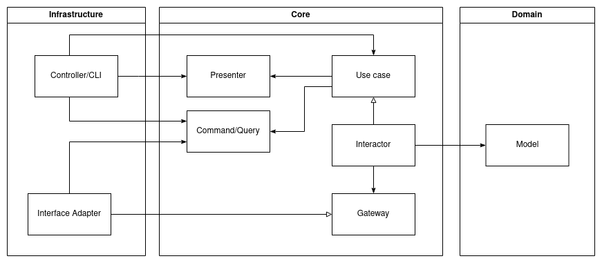

# Clean Architecture with Rust

This is a sample project to demonstrate how to
apply [Clean Architecture](https://blog.cleancoder.com/uncle-bob/2012/08/13/the-clean-architecture.html
) in Rust.

> Note: I'm exploring Rust so don't expect a good code quality.

## Getting Started

### Server

```bash
# start the server
cargo run
# http operations
curl --location --request GET 'http://localhost:8080/api/v1/users'
```

## Architecture

The dependency goes towards the
center - [The Dependency Rule](https://blog.cleancoder.com/uncle-bob/2012/08/13/the-clean-architecture.html#the-dependency-rule).



## License

Copyright 2023 © CSalih. All rights reserved.

Licensed under MIT